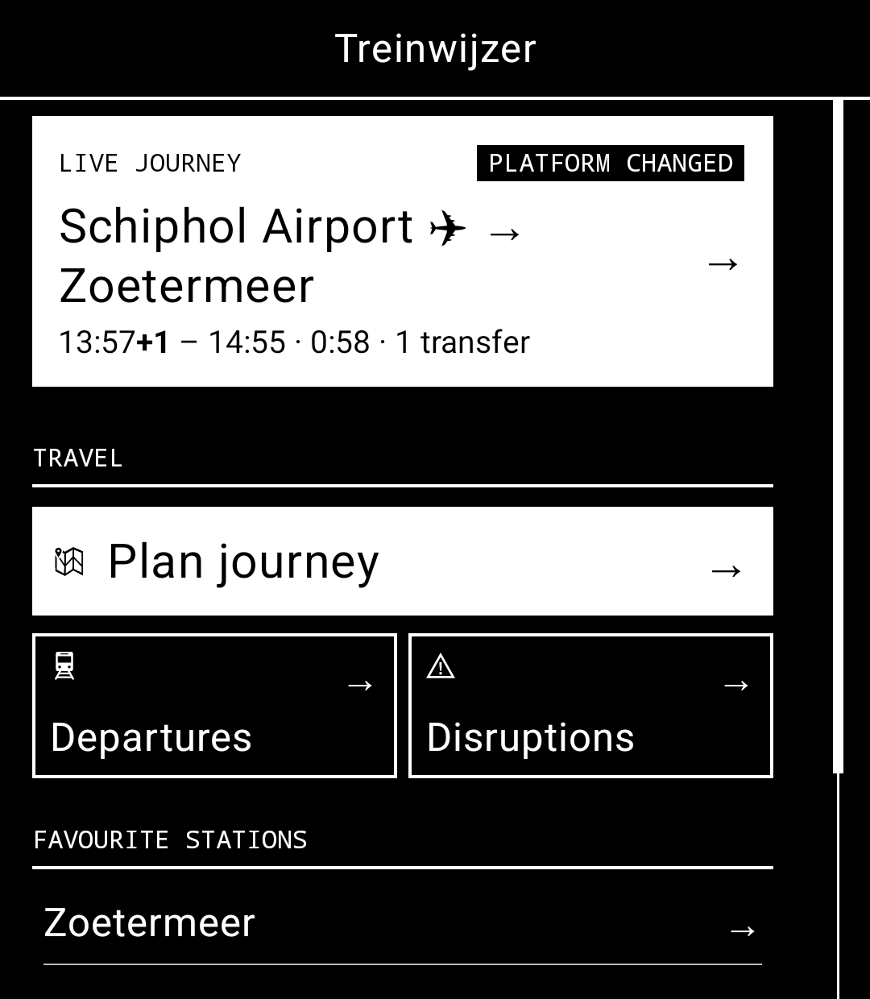
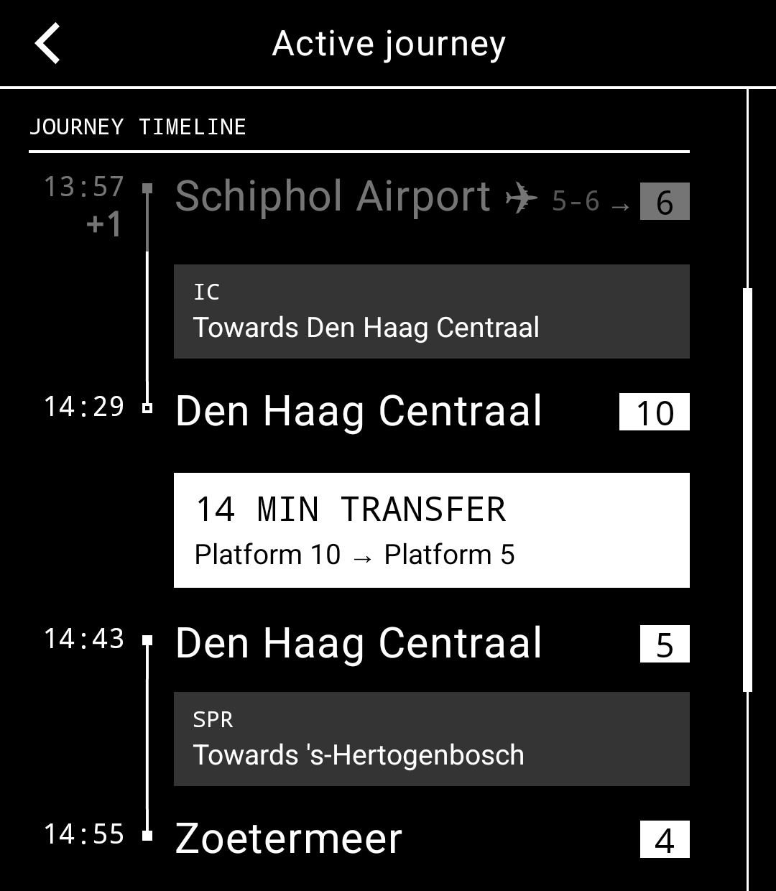
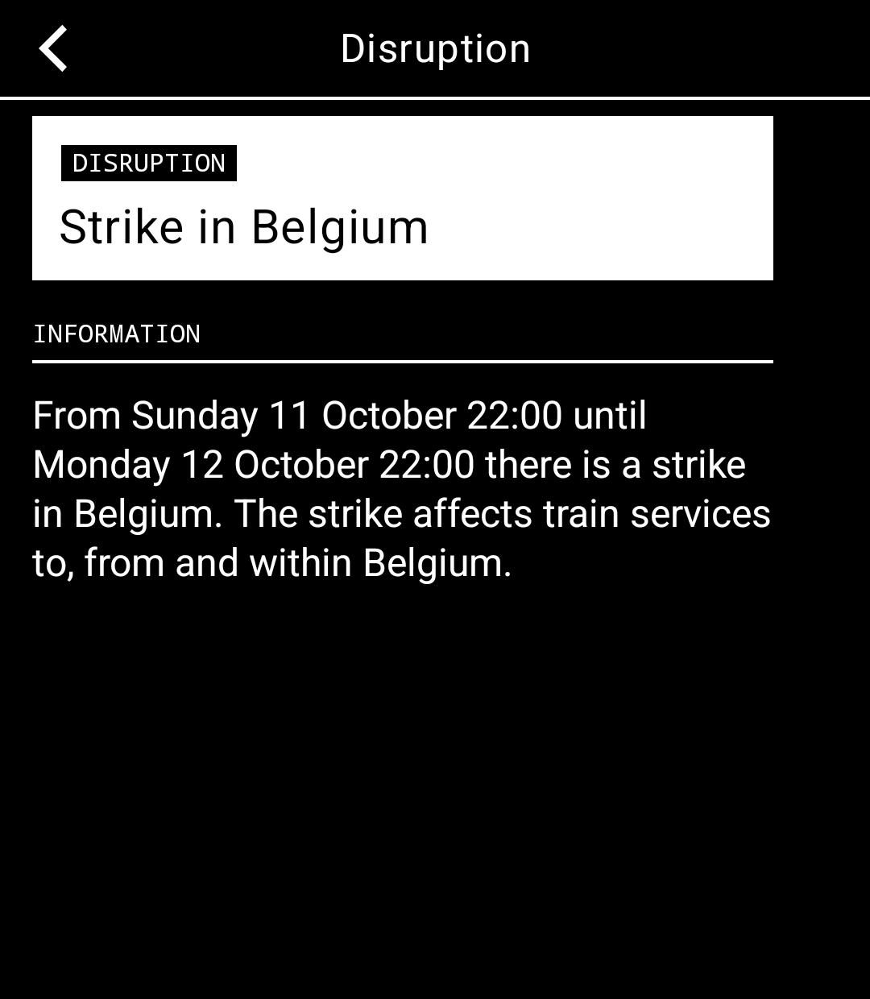

# Treinwijzer for Light Phone III

A free, open-source train planner for Dutch rail travel. Find your train, check your platform and follow your journey, with an interface built for LightOS.

<p>
  
  
  
</p>

Screenshots from the LightOS emulator.

## Features

- Live departures, platforms and train details.
- Journey planning with fares, stops and transfer information.
- Disruptions, delays and platform changes.
- Active journey tracking and alternative routes.
- Favourite stations, recent searches and nearby stations.
- Dutch and English interfaces.

Journey information updates while the tool is open. Unread journey alerts are retrieved when you reopen it; background notifications are not supported.

## Privacy

Favourites and preferences stay on your phone. Nearby stations are ranked locally, and your location is not sent to the backend.

Searches, journey requests and active tracking use the Treinwijzer service on Cloudflare, which obtains rail data from NS. An installation identity protects your journeys and alert inbox. The tool explains this before its first connection. No ads, analytics or account signup.

## Development

Use JDK 17, Android SDK platform 36 and the included Gradle wrapper. Add your Android SDK path to an ignored `local.properties`:

```properties
sdk.dir=/path/to/Android/sdk
```

Build and check the tool using the public Treinwijzer backend:

```sh
./gradlew -DlightSdk.toolOnly=true -Ptreinwijzer.production=true :tool:testDebugUnitTest :tool:lintDebug :tool:assembleDebug
```

For the emulator, follow the [setup guide](docs/simulator.md), then run:

```sh
./scripts/install-tool.sh
```

Use `./scripts/install-tool.sh --minified` to test with code and resource shrinking. For a physical phone, follow [Light’s Tool Manager instructions](docs/sideloading/README.md).

Treinwijzer lives in [`tool/`](tool/). The SDK and build tools come from [lightphone/light-sdk](https://github.com/lightphone/light-sdk). See the [SDK documentation](docs/README.md) and [notification limitations](docs/sdk-gaps.md). Backend code is maintained in [Treinwijzer](https://github.com/unequalsine/treinwijzer); the Light and watch apps use separate services and storage.

## Contributing

Bug reports, translations and improvements are welcome. See [CONTRIBUTING.md](CONTRIBUTING.md) for build checks and contribution guidelines.

## License

[MIT](LICENSE). Treinwijzer is an independent community project, not an official NS or Light Phone product.
